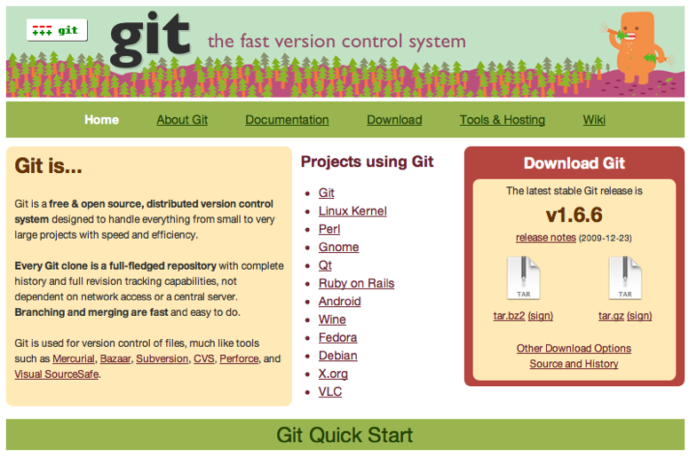
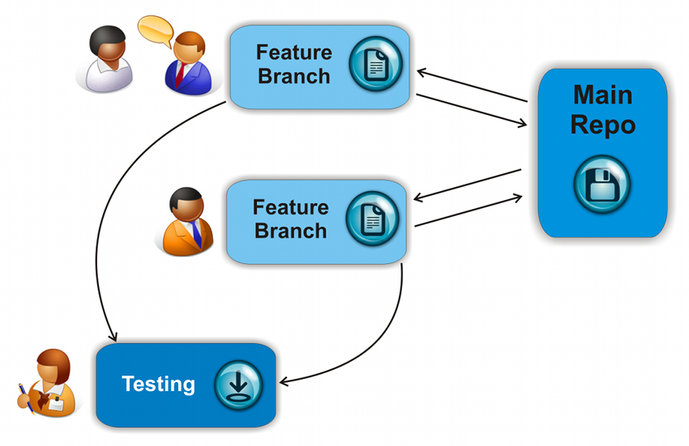

!SLIDE center 

#Introduction to Git

!SLIDE bullets --incremental transition=fade

# Table of Contents
* Introduction to Git
* Basic Commands
* Workflow
* Live demo
* Where to start?

!SLIDE center
#<me>

!SLIDE center
#Keyblade / Agile Workflow

!SLIDE center

## Forget everything you know
## about version control

!SLIDE center

!SLIDE 
#Motivation
## "*The end result was that I decided I can write something better than anything out there in two weeks, and I was right.*"

!SLIDE bullets incremental transition=fade

# What is it?
* Fast
* Distributed version control system
* Think in changes/patches not revisions
* Easy branching
* Automagical merging

