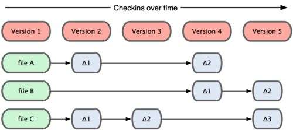

!SLIDE 

#Introduction to Git

!SLIDE bullets --incremental transition=fade

# ToC
* Introduction to Git
* Commands
* Workflow
* Live demo

!SLIDE center

## Forget everything you know
## about version control

!SLIDE bullets incremental transition=fade

# What is it?
* Fast
* Distributed version control system
* Think in changes/patches not revisions
* Easy branching
* Automagical merging

!SLIDE center smaller
# Git is a file system part 1

!SLIDE center smaller
#Git is a file system part 2
	 Snapshot of system each time a change is committed

!SLIDE center transition=scrollLeft
#How it works

!SLIDE commandline incremental small
#Commands
			
	$ git init
	create git repository in folder
	$ git status
	lists current status of repo eg.
	 On branch master
	 Changed but not updated:
	   (use "git add <file>..." to update what will be committed)
	   (use "git checkout -- <file>..." to discard changes in working directory)
	
		modified:   lib/TodoItem.rb
		modified:   spec/lib/spec_TodoItem.rb
	
	$ git add <file name>
	adds file to staging area
	$ git commit -m "MY MESSAGE"
	commits changes
	$ git checkout -b new_branch
	creates a new branch
	$ git checkout new_branch
	switches to new branch
	$ git pull --rebase
	get latest from trunk
	$ git push origin master
	push changes to server
